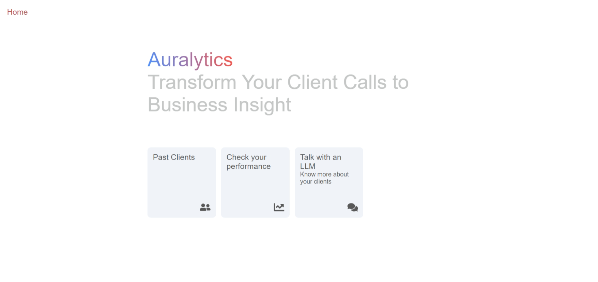

# Auralytics

Pitch Video: [Auralytics - Pitch](https://youtu.be/17PZWNGzWN0)

Demo Video: [Auralytics - Demo](https://youtu.be/tzfSPOWtni8)



## Background and Problem Statement

Improving customer relationships and understanding is a strategic priority for telecommunications companies and call centers aiming to remain competitive. Many of these businesses invest significant effort into enhancing the operational efficiency of their communication channels, particularly call centers. However, this mission is complex due to the sheer volume of calls received, making it challenging to address client needs effectively during or after calls. Moreover, dissatisfied customers today are likely to churn tomorrow, underscoring the importance of meeting customer expectations.

## Impact and Proposed Solution

**Solution.** We propose a speech analytics approach to automate tasks that do not require human intervention, enabling advisors to focus on more critical activities.

1. Client Identity Verification:
    - Automate client identity verification, which currently takes 30 seconds to 1 minute.
    - Automatically identify the client's name, phone number, address, postal code, and email address to save time and seamlessly transfer the customer to an advisor.
1. Post-Call Summarization:
    - Automatically generate summaries of calls to maintain a detailed call history.
    - This improves customer knowledge for future interactions and evaluates advisor performance and response relevance.
1. Sentiment Analysis:
    - Analyze customer sentiment throughout the call and compare the sentiment at the beginning and end.
    - This helps measure the advisor's ability to address client needs effectively.

**Added Value.**

1. **Call Summaries:**
    - Preserve customer call history to improve future interactions and better understand churn phenomena.
    - Reviewing summaries from churned customers can reveal patterns and reasons for dissatisfaction.
1. **Sentiment Analysis:**
    - Predict potential churners and trigger alerts for loyalty actions, such as offering discounts to retain customers.
1. **Augmented Advisor:**
    - Enhance agent performance with real-time retrieval-augmented generation (RAG) systems to provide accurate answers based on transcriptions of customer queries.

## Project Outcomes and Deliverables

- **Speech-to-Text:** Real-time transcription of conversations between agents and customers.
- **RAG System:** Integrated with transcriptions to suggest real-time answers to customer questions when advisors lack immediate responses.
- **Post-Call Summary and Sentiment Analysis:** Automatically generate summaries and sentiment insights after each call to maintain history and measure performance.

## Instructions

Make sure you have npm installed.

To run the front:

```bash
cd ./frontent
npm install
npm start
```

And for the backend, run:

```bash
cd ./backend
pip -r install requirements
python main.py
```
